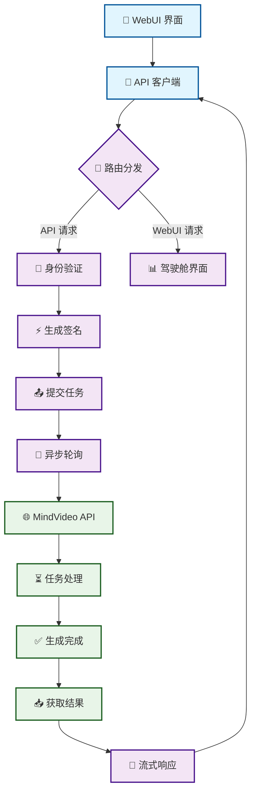
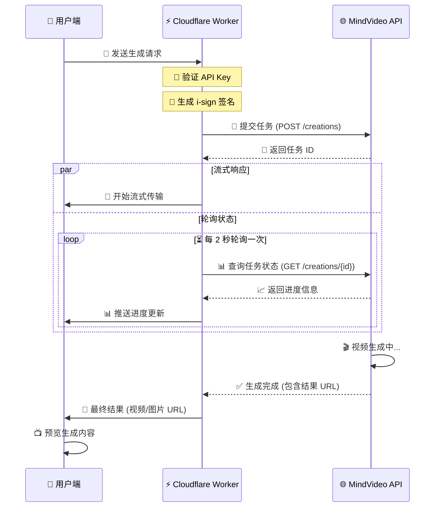
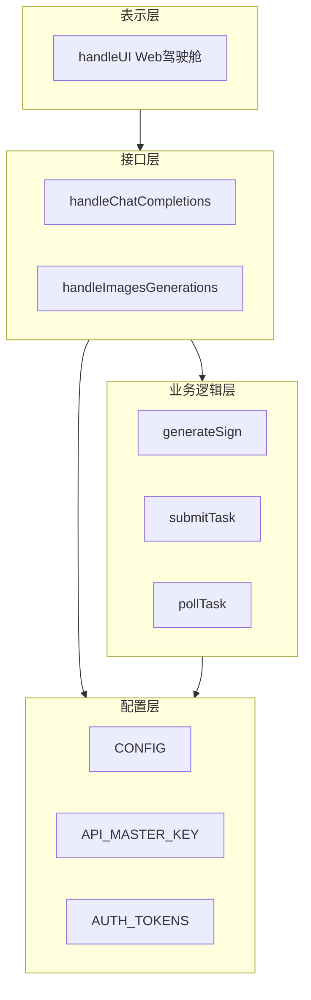

# 🧠 MindVideo-2API (Cloudflare Worker Edition)

[](https://opensource.org/licenses/Apache-2.0)
[](https://workers.cloudflare.com/)
[](https://github.com/lza6/mindvideo-2api-CFwork)

> **代号**: Chimera Synthesis - Visual Progress
>
> **仓库地址**: [https://github.com/lza6/mindvideo-2api-CFwork](https://github.com/lza6/mindvideo-2api-CFwork)

---

## 📖 序言：打破技术的围墙

在这个 AI 爆发的时代，视频生成的门槛依然存在。**MindVideo-2API** 的诞生，不仅仅是为了写一段代码，更是为了**让每一个人都能平等地触达最先进的 AI 创造力**。

无论你是想体验 Sora-2 的震撼，还是 Gemini-3 的细腻，本项目通过 Cloudflare Worker 这一边缘计算神器，将复杂的上游接口转化为标准的 OpenAI 格式 API 和一个优雅的 WebUI 驾驶舱。

**"他来他也行"** —— 这不是一句空话，而是开源精神赋予我们的力量。希望你在阅读和使用本项目的过程中，能感受到代码的温度和创造的乐趣。

---

## ✨ 核心特性 (v3.2.0)

*   **☁️ Serverless 架构**: 依托 Cloudflare Worker，无需购买服务器，每日 10 万次免费请求，零成本部署。
*   **🔄 OpenAI 接口兼容**: 提供 `/v1/chat/completions` 接口，完美适配 NextChat、One API 等第三方客户端。
*   **🖥️ 开发者驾驶舱 (WebUI)**: 内置精美的单文件 HTML 界面，支持**实时进度条**、双图上传 (图生图)、视频预览。
*   **🚀 极速响应**: 采用流式传输 (SSE) 和异步轮询机制，解决 HTTP 超时问题。
*   **🛡️ 安全与签名**: 内置 `i-sign` 签名算法 (MD5 + Nonce + Timestamp)，自动处理鉴权。
*   **🎨 多模型支持**:
    *   `sora-2-free`: 文生视频 (Sora-2 Video)
    *   `gemini-3-image`: 文生图 (Gemini-3 Pro)
    *   `gemini-3-i2i`: 图生图 (Gemini-3 I2I)

---

## 🛠️ 快速开始 (小白教程)

我们深知配置环境的痛苦，因此为您准备了最简单的部署方案。

### 方案 A: 懒人一键部署 (推荐)

1.  🆕 注册并登录 [Cloudflare](https://dash.cloudflare.com/)
2.  📝 在左侧菜单选择 **Workers & Pages** → **Create Application** → **Create Worker**
3.  🔧 命名为 `mindvideo-api`，点击 **Deploy**
4.  ✏️ 点击 **Edit code**，进入在线编辑器
5.  📋 **复制** 本仓库 `worker.js` 中的所有代码
6.  📝 **粘贴** 到编辑器中（覆盖原有代码）
7.  ⚙️ **修改配置**: 在代码顶部的 `CONFIG` 区域，填入您的 `AUTH_TOKENS` (MindVideo 的 Token，获取方法见下文)
8.  🚀 点击右上角 **Deploy**
9.  🎉 **完成！** 访问你的 Worker 域名即可看到 WebUI

### 方案 B: 本地开发部署 (开发者)

```bash
# 1. 克隆仓库
git clone https://github.com/lza6/mindvideo-2api-CFwork.git
cd mindvideo-2api-CFwork

# 2. 安装依赖 (需安装 Wrangler)
npm install -g wrangler

# 3. 登录 Cloudflare
wrangler login

# 4. 部署
wrangler deploy
```

### 🔑 如何获取 Token？

1.  🌐 访问 [MindVideo 官网](https://www.mindvideo.ai/) 并登录
2.  🔧 按 `F12` 打开开发者工具，点击 **Network (网络)** 标签
3.  📡 发起一次生成请求，找到 `creations` 或 `refresh` 接口
4.  📋 在 **Request Headers (请求头)** 中找到 `Authorization` 字段
5.  🔑 复制 `Bearer ` 后面的那串字符，填入代码中的 `AUTH_TOKENS` 数组中

---

## 🧩 技术原理与深度解析

本项目是一个典型的 **API Gateway (网关) + Adapter (适配器)** 模式。

### 1. 核心架构图



### 2. 请求处理时序图



### 3. 关键技术点 (难度评级: ⭐⭐⭐)

*   **逆向签名 (Reverse Engineering Signature)**:
    *   **原理**: 上游接口为了防止滥用，使用了 `i-sign` 校验
    *   **实现**: 代码中的 `generateSign()` 函数
    *   **算法**: `MD5("nonce=" + uuid + "&timestamp=" + now + "&app_key=" + secret)`
    *   **来源**: 通过浏览器开发者工具断点调试 JS 源码分析得出

*   **Server-Sent Events (SSE) 流式输出**:
    *   **原理**: 由于视频生成耗时较长 (1-2分钟)，普通 HTTP 请求会超时
    *   **实现**: `handleChatCompletions` 中使用 `TransformStream`
    *   **好处**: 客户端可以实时看到进度变化，用户体验极佳

*   **异步轮询 (Async Polling)**:
    *   **原理**: 提交任务后，服务器只返回 Task ID，需要不断查询状态
    *   **实现**: `pollTask` 函数配合 `while` 循环，智能处理进度卡顿

### 4. 核心组件说明



---

## 📊 优缺点与场景分析

### ✅ 优势亮点
1.  **🚀 极致便捷**: 单文件，无依赖，复制粘贴即用
2.  **💰 免费高效**: 利用 Cloudflare 强大的全球边缘网络
3.  **🔧 标准化**: 将私有 API 转化为通用的 OpenAI 格式，极易集成
4.  **👀 可视化**: 自带 UI，解决了 API 调试难的问题

### ⚠️ 局限说明
1.  **🔑 Token 依赖**: 需要手动抓取 Token，目前未实现自动保活
2.  **📊 上游限制**: 受限于 MindVideo 官方的并发限制和排队机制

### 🎯 适用场景
*   **🎨 个人创作者**: 快速生成短视频素材
*   **👨‍💻 开发者**: 研究 API 逆向工程、学习 Cloudflare Worker 开发
*   **🏢 SaaS 集成**: 将视频生成能力集成到自己的 AI 客服或工具站中

---

## 🔮 发展路线图 (Roadmap)

我们目前的版本是 **3.2.0**，但这只是开始。

### ✅ 已完成
- [x] 🎬 基础文生视频、文生图功能
- [x] 🔄 OpenAI 格式流式响应
- [x] 📊 WebUI 实时进度条与状态显示
- [x] 🇨🇳 错误信息中文汉化
- [x] 🖼️ 图生图 (Image-to-Image) 支持

### 🚧 开发中
- [ ] 🔄 Token 自动保活池
- [ ] 💾 KV 数据库集成
- [ ] 📨 Webhook 回调支持
- [ ] 🔌 更多模型适配

---

## 📂 项目架构解析

```mermaid
 graph TB
    A[🚀 worker.js 核心文件]
    
    A --> B[🎛️ 配置区]
    A --> C[🛣️ 路由区]
    A --> D[⚙️ 业务区]
    A --> E[🔌 接口区]
    A --> F[🎨 UI区]
    
    B --> B1[⚙️ CONFIG]
    B --> B2[🔑 API_MASTER_KEY]
    B --> B3[🎫 AUTH_TOKENS]
    
    C --> C1[🔄 fetch()]
    C --> C2[🗺️ 路由表]
    
    D --> D1[🔐 generateSign()]
    D --> D2[📤 submitTask()]
    D --> D3[🔄 pollTask()]
    
    E --> E1[💬 handleChatCompletions]
    E --> E2[🖼️ handleImagesGenerations]
    
    F --> F1[🖥️ handleUI]
    F --> F2[🎨 HTML/CSS/JS]
    
    %% 连接流程
    C1 --> D1
    D1 --> D2
    D2 --> D3
    D3 --> E1
    D3 --> E2
    C1 --> F1
    
    classDef config fill:#e1f5fe
    classDef router fill:#f3e5f5
    classDef business fill:#e8f5e8
    classDef api fill:#fff3e0
    classDef ui fill:#fce4ec
    classDef main fill:#ffebee
    
    class B,B1,B2,B3 config
    class C,C1,C2 router
    class D,D1,D2,D3 business
    class E,E1,E2 api
    class F,F1,F2 ui
    class A main
```

---

## 💡 开发者寄语

> "技术不应是少数人的特权，而应是全人类的工具。"

在编写这个项目的过程中，我特意保留了详细的注释和清晰的变量命名。无论你是刚入门的学生，还是经验丰富的工程师，我都希望你能通过阅读源码，理解 HTTP 协议的魅力，理解异步编程的奥妙。

如果你觉得这个项目对你有帮助，请不要吝啬你的 **Star ⭐**。你的每一次点击，都是对开源精神最大的鼓励！

让我们一起，用代码构建更美好的数字世界。🚀

---

## 📜 开源协议

本项目基于 [Apache License 2.0](https://opensource.org/licenses/Apache-2.0) 开源。
这意味着您可以自由地使用、修改、分发本项目，但请保留原作者的版权声明。

**免责声明**: 本项目仅供技术研究与学习交流使用，请勿用于任何非法用途。使用本项目产生的任何后果由使用者自行承担。本项目与 MindVideo 官方无任何关联。

---

<div align="center">

**如果这个项目帮助到了你，请给它一个 ⭐ 让更多人看到！**

[](https://star-history.com/#lza6/mindvideo-2api-CFwork&Date)

</div>

---

*文档最后更新: 2025年11月22日 03:35:52*  
